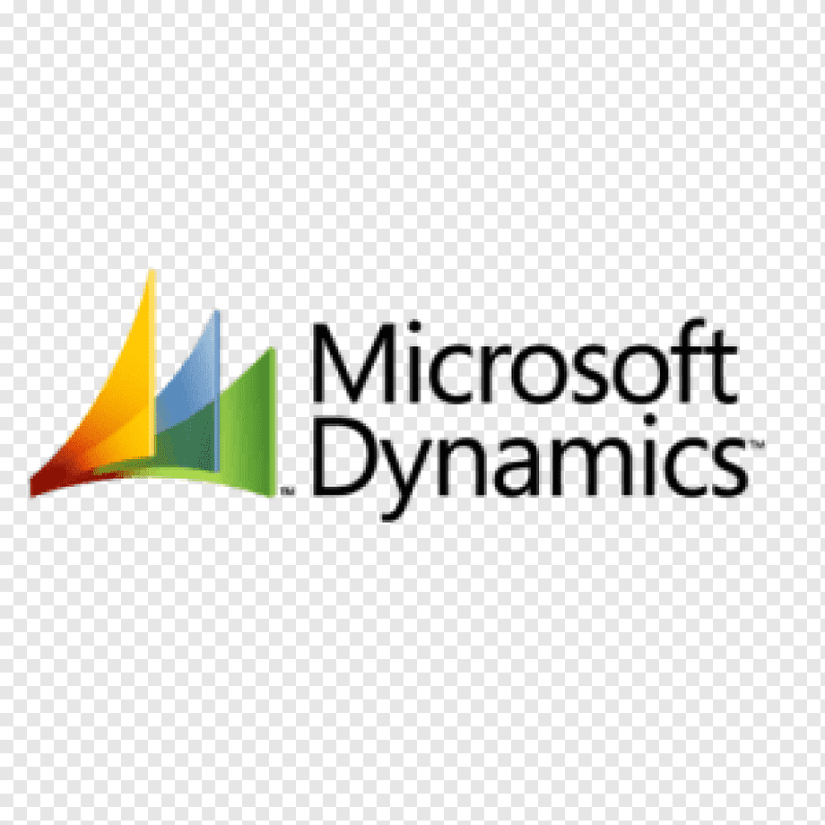

## Hi there, I'm Marko 👋

### Web development and technology is something I am really passionate about.

 

- 📚 Learning as much as I can on PHP/MySQL & MERN stack and working on some projects while at it 😄
- 🧐 Searching for full time job. ✅
- 🥅 2021 Goals:
  - be a lot more active on GitHub.
  - learn as much as I can on web development 😎
  - do a lot more software developing 💻
  - move to the Netherlands ✈ ✅
- ⚡ Fun fact: I love traveling and playing video games.

## At the moment I'm not working that much on side projects since I just moved and got a new job.

## Hopefully that will change soon 😊

### Connect with me:

[][website]
[][linkedin]

 

### Languages and Tools:

 
 

[website]: https://mikecmarko.github.io/
[linkedin]: https://www.linkedin.com/in/marko-mikec-957767171/
